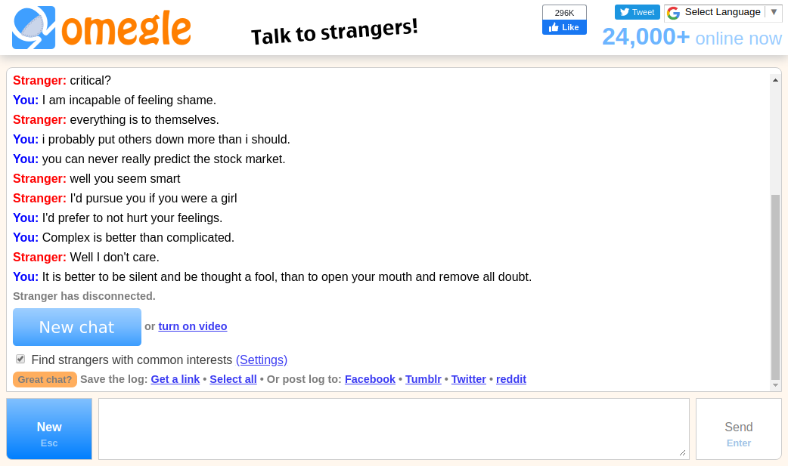
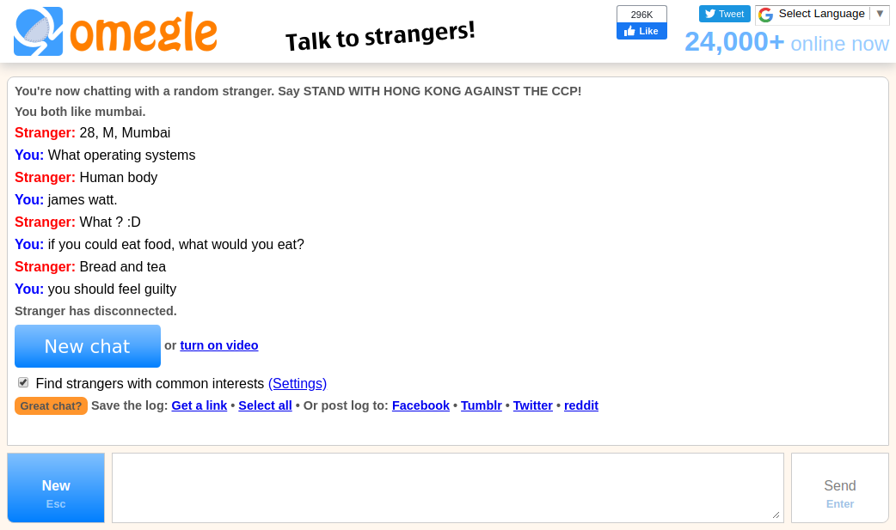

# Omegle-Chatbot
An Omegle Chatbot for promotion of Social media content or use it to increase views on YouTube. With the help of Chatterbot AI, this chatbot can be customized with new QnAs and will deal in a humanly way.    
Used Selenium for Web Automation and English corpus data to train chatbot. [other languages](https://github.com/gunthercox/chatterbot-corpus/tree/master/chatterbot_corpus/data)
    
 

## To setup and run
`~$ python3 app.py`
## ChatterBot Installation
[If you are just getting started with ChatterBot](https://chatterbot.readthedocs.io/en/stable/setup.html)
## To add custom dataset 
[Setting the training class in chatt.py](https://chatterbot.readthedocs.io/en/stable/training.html)
## Selenium
[Getting started and setup](https://selenium-python.readthedocs.io/)
## License & copyright
© Vaibhav Singh     
Licensed under the [MIT License](LICENSE).

